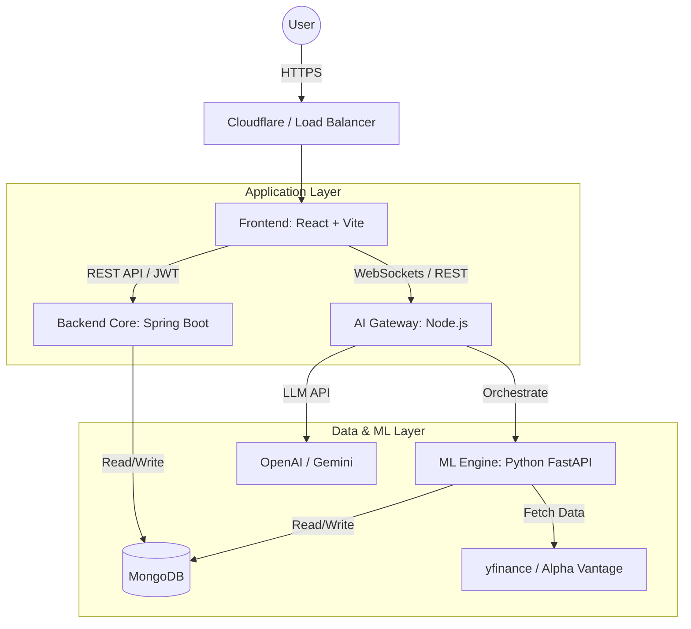

# 🧠 Nivesha.ai — AI-Powered Stock Market Investment Guide

**Nivesha.ai** is a production-grade, end-to-end stock market investment platform that combines traditional financial data analysis with advanced AI/ML capabilities. It provides users with real-time market data, portfolio management, and AI-driven investment advice.

---

## 🏗️ System Architecture (Hybrid Microservices)

We use a **Hybrid Microservice Architecture** to leverage the best tools for each specific domain:
*   **Java (Spring Boot)** for robust, secure, and transactional backend operations.
*   **Node.js (Express)** for high-concurrency, I/O-bound AI orchestration.
*   **Python (FastAPI)** for data-intensive machine learning and statistical modeling.



### ❓ Why This Hybrid Architecture?
| Component | Technology | Reasoning |
| :--- | :--- | :--- |
| **Frontend** | React + Vite | Fast, interactive SPA with rich ecosystem (Recharts, Tailwind). |
| **Core Backend** | Spring Boot | Enterprise-grade security (Spring Security), type safety, and reliability for financial transactions and user data. |
| **AI Gateway** | Node.js | Non-blocking I/O is ideal for handling long-running AI requests (streaming responses) and proxying external LLM APIs. |
| **ML Engine** | Python | The absolute standard for Data Science (pandas, sklearn, TensorFlow). No other language competes for financial ML libraries. |
| **Database** | MongoDB | Flexible schema allows easy storage of unstructured AI logs, diverse stock data structures, and user profiles. |

---

## 🔄 Data Flow Step-by-Step

### 1. User Authentication
1.  User logs in via **Frontend**.
2.  Request sent to **Spring Boot Backend**.
3.  Backend validates credentials against **MongoDB** and issues a **JWT**.
4.  Frontend stores JWT for subsequent requests.

### 2. Stock Analysis Request
1.  User visits `/stock/AAPL`.
2.  **Frontend** calls **Spring Boot** to check for cached basic info.
3.  **Frontend** simultaneously calls **AI Gateway** for "Live AI Analysis".
4.  **AI Gateway** orchestrates:
    *   Fetches latest inference from **ML Engine** (Python).
    *   Sends prompt + data to **OpenAI/Gemini**.
5.  **ML Engine** fetches raw market data (yfinance -> Alpha Vantage fallback), runs ARIMA/Prophet models, and returns JSON predictions.
6.  **AI Gateway** aggregates ML components and LLM text, streaming the response to the Frontend.

### 3. Portfolio Management
1.  User adds a stock to portfolio.
2.  **Spring Boot** updates the `users` collection in **MongoDB**.
3.  Background job (optional) triggers **ML Engine** to re-evaluate portfolio risk.

---

## 📂 Project Structure

```
nivesha-ai/
├── frontend/             # React + Vite application
├── backend-springboot/   # Main API (Auth, Portfolio, User Service)
├── backend-node-ai/      # Gateway for AI/LLM interactions
├── backend-python-ml/    # ML models (Prediction, Sentiment)
├── .env.example          # Environment variables template
└── README.md             # This file
```
